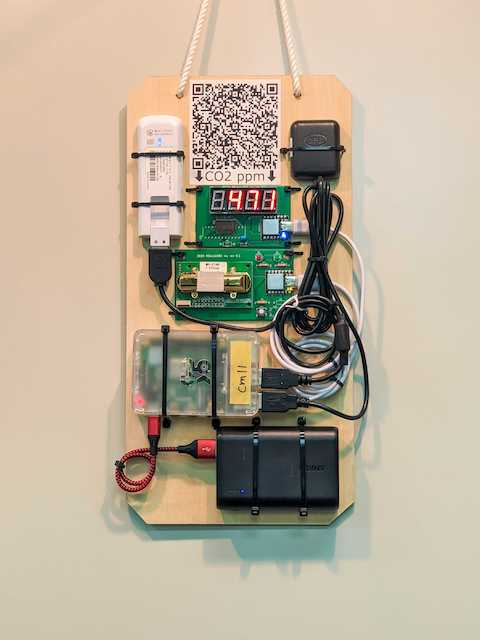

# co2mon



RaspberryPiベースのコネクテッドなCO2モニタ

## 必要なハードウェア

### 必須

- RaspberryPi 4
- [usb_co2](https://github.com/realglobe-Inc/usb_co2)
- [usb_7seg](https://github.com/realglobe-Inc/usb_7seg)
- ACアダプタ
  - [スイッチングACアダプター（USB ACアダプター） Type-Cオス 5.1V3.8A](https://akizukidenshi.com/catalog/g/gM-14935/) がおすすめ

### オプショナル

- PIX-MT100
  - セルラー回線（LTE）で使用する場合のみ
- USB接続のGPS受信機
  - 車載の場合など、移動しながら使用する場合のみ
  - [GU-902MGG-USB](https://akizukidenshi.com/catalog/g/gM-14541/)が動作確認済
- モバイルバッテリー
  - 車載の場合など、移動しながら使用する場合のみ

## デプロイ

- 手順がRaspberryPiのセットアップとアプリケーションのセットアップに分かれています
- リバースポートフォワードを使用すると、RaspberryPiがどこのネットワークに存在していてもsshでシェルログインが可能になります

### RaspberryPiのセットアップ（sshリバースポートフォワードを使用しない場合）

#### microSDの書き込み

microSDの書込には、`write_sd.sh` を使用します。

`write_sd.sh` はカレントディレクトリに `ssh_keys` ファイルが存在することを期待するので、以下のコマンドを実行して、ssh公開鍵を `ssh_keys` に書き込んでおきます。

```sh
cat ~/.ssh/id_ed25519.pub >> ssh_keys
```

次に、`write_sd.sh` を実行します。
`<ホスト名>` は、設定対象のRaspberryPiに設定したいホスト名です。

```sh
./write_sd.sh <ホスト名>
```

#### 起動と接続の確認

書込が終わったら、RaspberryPiにmicroSDを挿し替えて、イーサネット（LANケーブル）と電源を接続する。
1分ほど待ってOSが起動したら、次のコマンドを実行する。

```sh
ssh -o UserKnownHostsFile=/dev/null -o StrictHostKeyChecking=no pi@raspberrypi.local /boot/setup/setup_raspberrypi.sh
# パスワードは raspberry
```

セットアップが完了すると自動的に再起動する。
これ以降は以下のコマンドでRaspberryPiにシェルログインできる。

```sh
ssh pi@<ホスト名>.local
```

### RaspberryPiのセットアップ（sshリバースポートフォワードを使用する場合）

#### microSDの書き込み

microSDの書込には、`write_sd.sh` を使用します。

`write_sd.sh` はカレントディレクトリに `ssh_keys` ファイルが存在することを期待するので、以下のコマンドを実行して、ssh公開鍵を `ssh_keys` に書き込んでおきます。

```sh
cat ~/.ssh/id_ed25519.pub >> ssh_keys
```

次に、`write_sd.sh` を実行します。
`<ホスト名>` は、設定対象のRaspberryPiに設定したいホスト名です。

```sh
./write_sd.sh -p <リバースフォワードで使用するポート> -r <リバースフォワードサーバのIPアドレス> -u <リバースフォワードサーバに接続するユーザ> -k <リバースフォワードサーバのホスト鍵> <ホスト名>
```

リバースフォワードに使用するsshサーバが22番以外で接続を待ち受けている場合は、以下ように`-P`オプションをつけて実行します。

```sh
./write_sd.sh -p <リバースフォワードで使用するポート> -r <リバースフォワードサーバのIPアドレス> -P <リバースフォワードサーバのsshポート> -u <リバースフォワードサーバに接続するユーザ> -k <リバースフォワードサーバのホスト鍵> <ホスト名>
```

#### 起動と接続の確認

書込が終わったら、RaspberryPiにmicroSDを挿し替えて、イーサネット（LANケーブル）と電源を接続する。
1分ほど待ってOSが起動したら、次のコマンドを実行する。

```sh
ssh -o UserKnownHostsFile=/dev/null -o StrictHostKeyChecking=no pi@raspberrypi.local /boot/setup/setup_raspberrypi.sh
# パスワードは raspberry
```

セットアップが完了すると自動的に再起動する。
これ以降は以下のコマンドでRaspberryPiにシェルログインできる。

```sh
ssh pi@<ホスト名>
```

または、

```sh
ssh pi@<ホスト名>.local
```

### アプリケーションのデプロイ

- `deploy.sh`を実行すると、ビルド、Dockerイメージの転送、HecEyeとのペアリング、緯度経度の設定が行われる
- `paring_url` はHecEyeでデバイスを追加したときにQRコードの下に表示されるURL
- `target`はssh接続先として有効な文字列
  - `RaspberryPiのセットアップ` で指定したホスト名を用いて、同一セグメントからアクセスする場合: <ホスト名>.local
- `lat`は緯度, `lng` は経度
  - 設置したい場所の`lat`と`lng`を知るには、[地理院地図](https://maps.gsi.go.jp/)や[OpenStreetMap](https://www.openstreetmap.org/)を使うとよい

```sh
brew install pv  # 最初の1回のみ
./deploy.sh <target> <paring_url> <lat> <lng>
```

```sh
# 例
./deploy.sh pi@co2mon.local https://demo.hec-eye.jp/a/625c2d59bXXXXXXXX 35.70161 139.75318
```

## co2monを使用しているプロジェクト

- [Project AIRNORM](https://scrapbox.io/realglobe/Project_AIRNORM)


## 開発

開発者向けの情報は [DEVELOPMENT.md](DEVELOPMENT.md) を見てください
